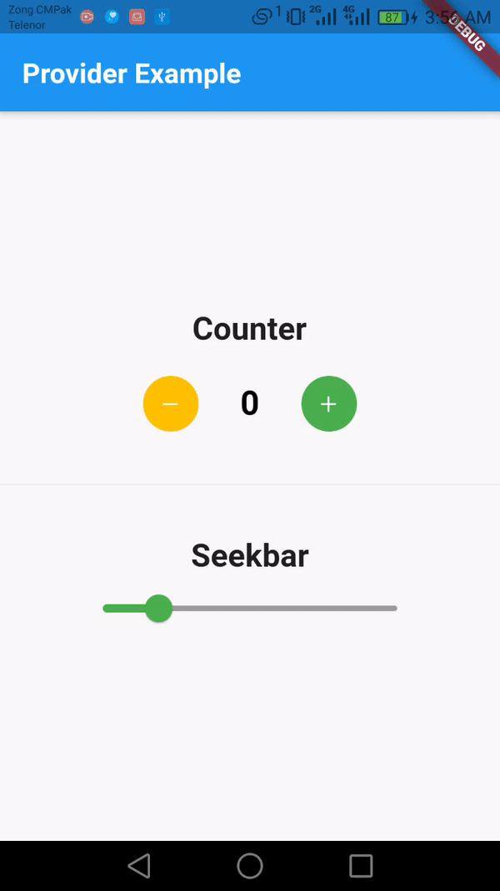

# Flutter Provider Demo

## What is Provider
Provider is one of the many state management options when using Flutter. It's one of the first state manager recommended by Flutter itself and one of the simplest. If you're new to state management check out the official pages that describes the different state managers and how/when you should use it https://flutter.dev/docs/development/data-and-backend/state-mgmt/options.


### App Demo


 
 
 
### Adding dependency

  ```sh
  provider: ^6.0.0
  
   ```
### Model Class
Create a new dart file called by the name of mymodel.dart
 ```sh
  
class MyModel extends ChangeNotifier {
  int _mycount = 0;
  int _valueHolder = 20;
  int get counter => _mycount;
  int get slide => _valueHolder;

  void addData() {
    _mycount++;
    notifyListeners();
  }
  void subractData() {
    _mycount--;
    notifyListeners();
  }
  void sliderData(double newValue) {
    _valueHolder = newValue.round();
    notifyListeners();
  }
}

   ```

### Main Class

```sh
void main() {
  runApp(MyApp());
}

class MyApp extends StatelessWidget {
  @override
  Widget build(BuildContext context) {
    return MaterialApp(
      title: 'Flutter Demo',
      theme: ThemeData(
        primarySwatch: Colors.blue,
      ),
      home: ChangeNotifierProvider(
          create: (context) => MyModel(), child: MyHomePage()),
    );
  }
}

class MyHomePage extends StatelessWidget {
  @override
  Widget build(BuildContext context) {
    var provider = Provider.of<MyModel>(context);
    return Scaffold(
      appBar: AppBar(
        title: Text(
          'Provider Example',
          style: TextStyle(fontWeight: FontWeight.bold),
        ),
      ),
      body: Center(
        child: Column(
          mainAxisAlignment: MainAxisAlignment.center,
          crossAxisAlignment: CrossAxisAlignment.center,
          children: [
            Text(
              'Counter',
              style: TextStyle(fontWeight: FontWeight.bold, fontSize: 23),
            ),
            SizedBox(
              height: 20,
            ),
            Row(
              mainAxisAlignment: MainAxisAlignment.center,
              children: [
                CircleAvatar(
                  backgroundColor: Colors.amber,
                  child: IconButton(
                    onPressed: provider.subractData,
                    icon: Icon(
                      CupertinoIcons.minus,
                      color: Colors.white,
                      size: 16,
                    ),
                  ),
                ),
                SizedBox(
                  width: 30,
                ),
                Consumer<MyModel>(builder: (context, data, child) {
                  return Text(
                    '${data.counter}',
                    style: TextStyle(
                        fontSize: 24,
                        color: Colors.black,
                        fontWeight: FontWeight.bold),
                  );
                }),
                SizedBox(
                  width: 30,
                ),
                CircleAvatar(
                  backgroundColor: Colors.green,
                  child: IconButton(
                    onPressed: provider.addData,
                    icon: Icon(
                      CupertinoIcons.plus,
                      color: Colors.white,
                      size: 16,
                    ),
                  ),
                ),
              ],
            ),
            SizedBox(
              height: 30,
            ),
            Divider(),
            SizedBox(
              height: 30,
            ),
            Text(
              'Seekbar',
              style: TextStyle(fontWeight: FontWeight.bold, fontSize: 23),
            ),
            Container(
                margin: EdgeInsets.symmetric(horizontal: 80),
                child: Consumer<MyModel>(
                  builder: (context, data, child) {
                    return Slider(
                        value: provider.slide.toDouble(),
                        min: 1,
                        max: 100,
                        divisions: 100,
                        activeColor: Colors.green,
                        inactiveColor: Colors.grey,
                        label: '${provider.slide}',
                        onChanged: (double newValue) {
                          provider.sliderData(newValue);
                        },
                        semanticFormatterCallback: (double newValue) {
                          return '${newValue.round()}';
                        });
                  },
                ))
          ],
        ),
      ),
    );
  }
}

```


## Getting Started

This project is a starting point for a Flutter application.

A few resources to get you started if this is your first Flutter project:

- [Lab: Write your first Flutter app](https://flutter.dev/docs/get-started/codelab)
- [Cookbook: Useful Flutter samples](https://flutter.dev/docs/cookbook)

For help getting started with Flutter, view our
[online documentation](https://flutter.dev/docs), which offers tutorials,
samples, guidance on mobile development, and a full API reference.
